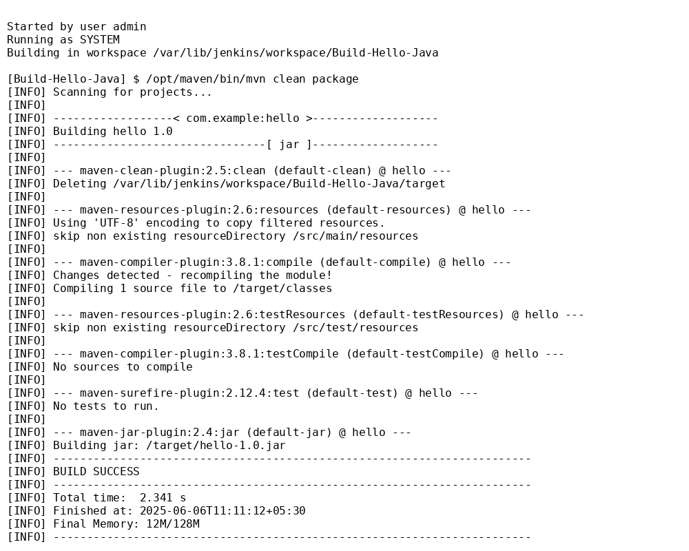

# 🔧 Jenkins + Maven Build Job – Task 8

## 🎯 Task Overview

This task focuses on automating the build process of a simple Java application using Jenkins and Maven. The goal is to understand basic CI/CD by setting up a Jenkins Freestyle Job that compiles and packages a Java project.

---

## 🧰 Tools & Technologies Used

- Jenkins (LTS version, run via Docker)
- Java JDK 8
- Apache Maven
- GitHub for version control

---

## 📁 Project Structure

hello-maven-java/
├── pom.xml
├── README.md
├── jenkins\_build\_success\_screenshot.png
└── src/
└── main/
└── java/
└── HelloWorld.java

`

---

## 🔨 Steps Followed

1. Created a basic Java file HelloWorld.java that prints a greeting message.
2. Wrote a pom.xml for Maven to define project metadata and build configuration.
3. Ran Jenkins locally using Docker:
   bash
   docker run -p 8080:8080 jenkins/jenkins:lts
`

4. Added Maven configuration under *Global Tool Configuration* in Jenkins.
5. Created a *Freestyle Project* in Jenkins called Java-Maven-Build.
6. Configured the build step to use Maven goals:

   
   clean package
   
7. Built the project and observed the output logs.
8. Verified that the build succeeded and a .jar file was generated.
9. Took a screenshot of the Jenkins console output showing BUILD SUCCESS.
10. Uploaded the code and files to GitHub with a clean folder structure.

---

## 🖼 Screenshot of Jenkins Console Output

Below is the screenshot taken from Jenkins after a successful Maven build:

---
